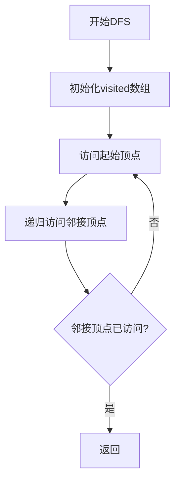
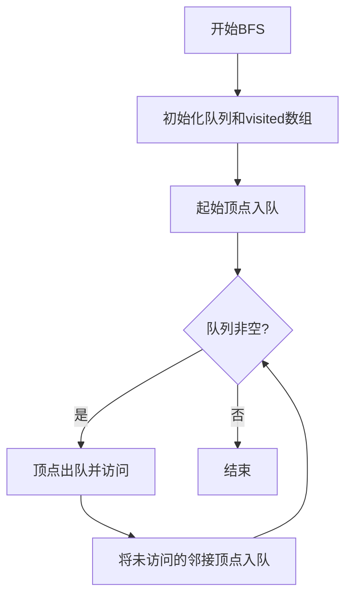
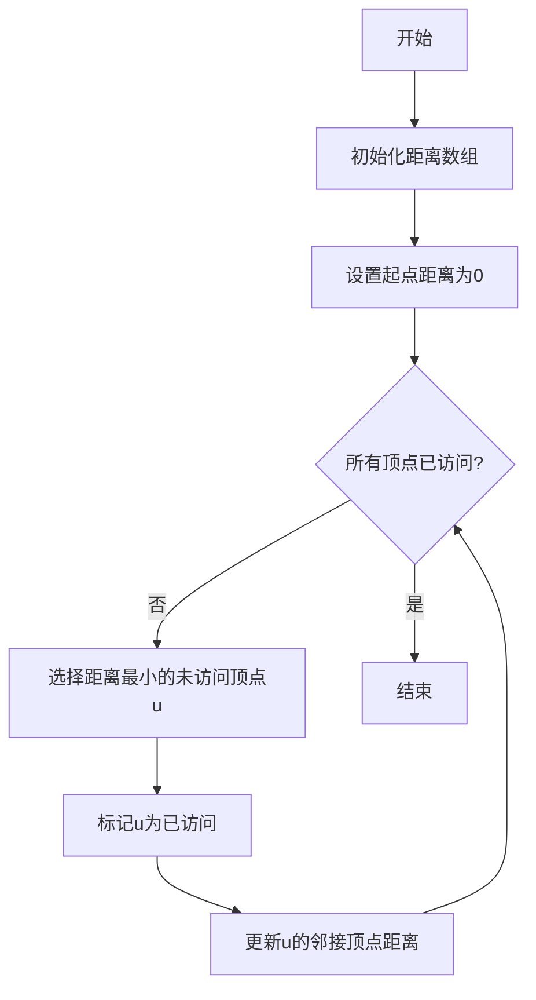

# C语言图数据结构实现

[](https://en.wikipedia.org/wiki/C11_(C_standard_revision))
[](LICENSE)

一个使用C语言实现的通用图数据结构库，采用**邻接表**存储方式，支持有向图和无向图，提供完整的图操作和经典算法实现。

## 数据结构

```
┌─────────────────────────────────────────────────────────┐
│                        Graph                            │
├─────────────────────────────────────────────────────────┤
│  vertices[]  │  vertexCount  │  capacity  │ isDirected │
└──────┬──────────────────────────────────────────────────┘
       │
       ▼
┌─────────────────────────────────────────────────────────┐
│  Vertex[0]    Vertex[1]    Vertex[2]    ...             │
│  ├─ data      ├─ data      ├─ data                      │
│  └─ firstEdge └─ firstEdge └─ firstEdge                 │
│       │            │            │                       │
│       ▼            ▼            ▼                       │
│   ┌──────┐     ┌──────┐     ┌──────┐                    │
│   │Edge  │     │Edge  │     │Edge  │                    │
│   ├─dest │     ├─dest │     ├─dest │                    │
│   ├─weight    ├─weight    ├─weight                      │
│   └─next─┘───►└─next─┘───►└─next─┘───► NULL            │
└─────────────────────────────────────────────────────────┘
```

## 核心API

### 图的创建与销毁

| 函数                                | 描述             |
| ----------------------------------- | ---------------- |
| `graphCreate(capacity, isDirected)` | 创建一个新图     |
| `graphDestroy(g)`                   | 销毁图并释放内存 |

### 顶点操作

| 函数                           | 描述                 |
| ------------------------------ | -------------------- |
| `graphAddVertex(g, data)`      | 添加顶点             |
| `graphRemoveVertex(g, index)`  | 删除顶点             |
| `graphGetVertexIndex(g, data)` | 根据数据查找顶点索引 |
| `graphGetVertexData(g, index)` | 获取顶点数据         |
| `graphVertexCount(g)`          | 获取顶点数量         |

### 边操作

| 函数                                | 描述           |
| ----------------------------------- | -------------- |
| `graphAddEdge(g, from, to, weight)` | 添加边         |
| `graphRemoveEdge(g, from, to)`      | 删除边         |
| `graphHasEdge(g, from, to)`         | 判断边是否存在 |
| `graphGetEdgeWeight(g, from, to)`   | 获取边权重     |

### 图的遍历

| 函数                      | 描述         |
| ------------------------- | ------------ |
| `graphDFS(g, startIndex)` | 深度优先搜索 |
| `graphBFS(g, startIndex)` | 广度优先搜索 |

### 图算法

| 函数                                       | 描述                 |
| ------------------------------------------ | -------------------- |
| `graphDijkstra(g, startIndex, dist, prev)` | Dijkstra最短路径算法 |
| `graphInDegree(g, index)`                  | 计算顶点入度         |
| `graphOutDegree(g, index)`                 | 计算出度             |

## 使用示例

```c
#include <stdio.h>

int main() {
    // 创建一个有向带权图
    Graph* g = graphCreate(10, true);
    
    // 添加顶点
    graphAddVertex(g, 0);
    graphAddVertex(g, 1);
    graphAddVertex(g, 2);
    
    // 添加带权边
    graphAddEdge(g, 0, 1, 10);  // 0 -> 1, 权重10
    graphAddEdge(g, 0, 2, 5);   // 0 -> 2, 权重5
    graphAddEdge(g, 1, 2, 2);   // 1 -> 2, 权重2
    
    // 图遍历
    graphDFS(g, 0);  // 深度优先搜索
    graphBFS(g, 0);  // 广度优先搜索
    
    // Dijkstra最短路径
    int dist[3], prev[3];
    graphDijkstra(g, 0, dist, prev);
    
    // 打印图结构
    graphPrint(g);
    
    // 销毁图
    graphDestroy(g);
    
    return 0;
}
```

## 算法流程

### DFS 深度优先搜索



### BFS 广度优先搜索



### Dijkstra最短路径



## 编译运行

```bash
# 编译
gcc -o graph 图.cpp -std=c11

# 运行
./graph
```

## 测试输出示例

```
C:\Users\anjuxi\Desktop\C语言 图>a.exe
=== 图结构测试 ===

【无向图测试】

图结构 (无向图, 5个顶点):
顶点[0](数据=0): -> [2](权重=1) -> [1](权重=1)
顶点[1](数据=1): -> [3](权重=1) -> [0](权重=1)
顶点[2](数据=2): -> [3](权重=1) -> [0](权重=1)
顶点[3](数据=3): -> [4](权重=1) -> [2](权重=1) -> [1](权重=1)
顶点[4](数据=4): -> [3](权重=1)

DFS遍历: 0 2 3 4 1
BFS遍历: 0 2 1 3 4
顶点0的度: 2
无向图已销毁

【有向带权图测试】

图结构 (有向图, 5个顶点):
顶点[0](数据=0): -> [2](权重=5) -> [1](权重=10)
顶点[1](数据=1): -> [3](权重=1) -> [2](权重=2)
顶点[2](数据=2): -> [4](权重=2) -> [3](权重=9) -> [1](权重=3)
顶点[3](数据=3): -> [4](权重=4)
顶点[4](数据=4): -> [3](权重=6)

DFS遍历: 0 2 4 3 1
BFS遍历: 0 2 1 4 3
顶点1的入度: 2, 出度: 2

从顶点0到各顶点的最短路径:
到顶点[0]: 距离=0, 路径=0
到顶点[1]: 距离=8, 路径=0 2 1
到顶点[2]: 距离=5, 路径=0 2
到顶点[3]: 距离=9, 路径=0 2 1 3
到顶点[4]: 距离=7, 路径=0 2 4

删除边 0->1 后:

图结构 (有向图, 5个顶点):
顶点[0](数据=0): -> [2](权重=5)
顶点[1](数据=1): -> [3](权重=1) -> [2](权重=2)
顶点[2](数据=2): -> [4](权重=2) -> [3](权重=9) -> [1](权重=3)
顶点[3](数据=3): -> [4](权重=4)
顶点[4](数据=4): -> [3](权重=6)

有向图已销毁

```

## 依赖

[](https://en.wikipedia.org/wiki/C_standard_library)

- 标准C库：`<stdio.h>`, `<stdlib.h>`, `<stdbool.h>`, `<limits.h>`
- 编译器：支持C11标准的GCC或Clang

## 时间复杂度

| 操作         | 时间复杂度 |
| ------------ | ---------- |
| 添加顶点     | O(1)       |
| 删除顶点     | O(V + E)   |
| 添加边       | O(1)       |
| 删除边       | O(E)       |
| DFS遍历      | O(V + E)   |
| BFS遍历      | O(V + E)   |
| Dijkstra算法 | O(V²)      |

> V = 顶点数, E = 边数

## 作者信息

**谙弆悕博士（Ailan Anjuxi）**

- 📧 邮箱：[anjuxi.ME@outlook.com](mailto:anjuxi.ME@outlook.com)
- 📞 SIP电话：[sip:anjuxi@sip.linphone.org](sip:anjuxi@sip.linphone.org)

---

*本项目用于学习和教学目的，展示了图数据结构的基本实现和常用算法。*
